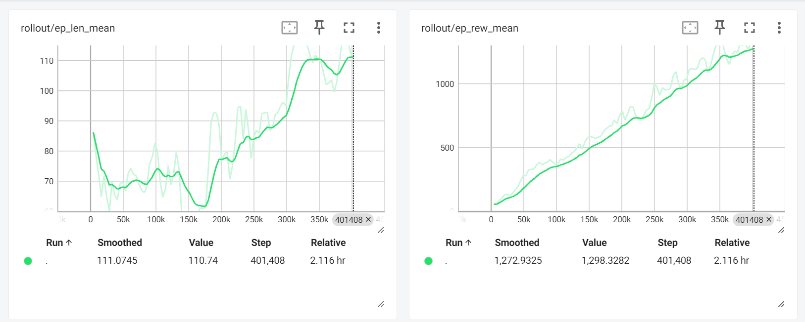
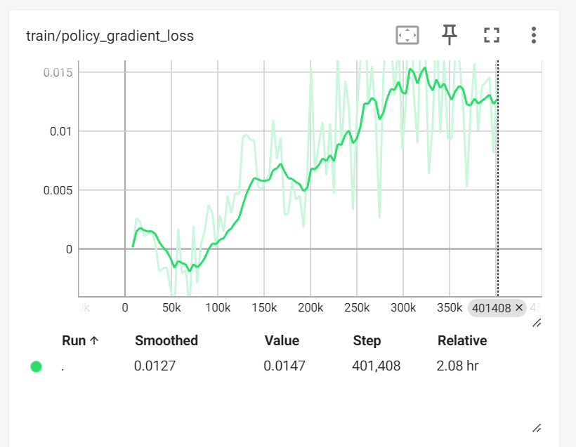

# **🌐 Doom Reinforcement Learning Agent**

Welcome to the **Doom RL Agent** project! This repository features a fully functional **Reinforcement Learning** (RL) model that plays the iconic Doom game. Leveraging custom **Gym environments**, reward shaping, and curriculum learning, we achieve impressive results across various Doom scenarios.

## **🌟 Features**
1. **Custom Gym Environments**
   - Developed a tailored environment for ViZDoom using OpenAI Gym standards.
   - Handles game states, rewards, and actions efficiently.

2. **Reward Shaping**
   - Designed a custom reward function to incentivize effective gameplay, considering:
     - Damage Taken
     - Hit Count
     - Ammo Usage

3. **Curriculum Learning**
   - Trained the agent progressively across increasing levels of difficulty:
     - **Basic Scenario**
     - **Defend the Center**
     - **Deadly Corridor**

4. **Stable Baselines3 Integration**
   - Used **PPO (Proximal Policy Optimization)** for training.
   - Configurable hyperparameters to enhance model performance.

5. **TensorBoard Logging**
   - Training metrics, including **average episode length** and **reward trends**, are visualized in TensorBoard.

6. **Trained Model Weights**
   - Pre-trained model weights are available for immediate testing!
   `training\deadly_corridor\s1\best_model460000.zip`

7. **Official ViZDoom Repository**
   - Clone the official ViZDoom repository to get started:
     ```bash
     git clone https://github.com/Farama-Foundation/ViZDoom
     ```

---

## **📊 Project Highlights**
### **Custom Gym Environment**
Creating the Gym environment was the most challenging and rewarding part of this project. The challenge lay in accurately managing game states, converting visuals to an optimized grayscale format, and defining a reward system that effectively guided the agent's learning. At the same time, it was rewarding to see the environment integrate seamlessly with Stable Baselines3, allowing the agent to progressively improve its performance. The environment includes:
- RGB to Grayscale conversion for optimized inputs.
- Custom reward logic for effective reinforcement learning.
- Compatibility with the Stable Baselines3 library.

### **Reward Shaping**
The reward function ensures the agent learns to:
- Minimize damage taken.
- Increase the hit count.
- Efficiently use ammunition.

### **Curriculum Learning**
To improve learning efficiency, the model is trained progressively across scenarios:

**Scenario**

<div style="display: flex; gap: 10px; flex-wrap: wrap; align-items: center; text-align: center;"> <div> <p>Basic Scenario</p>  </div> <div> <p>Defend the Center</p>  </div> </div>

<div style="display: flex; gap: 10px; flex-wrap: wrap; align-items: center; text-align: center;"> <div> <p>S1 Doom Skill = 1</p>  </div> <div> <p>S1 Doom Skill = 2</p>  </div> <div> <p>S1 Doom Skill = 3</p>  </div> <div> <p>S1 Doom Skill = 4</p>  </div> <div> <p>S1 Doom Skill = 5</p>  </div> </div>

---


**📊 Example Training Graphs:**

- **Episode Reward Mean and Episode Length Mean**
  

- **Policy Gradient Loss**
  

---

## **🤖 Trained Agent in Action**
The trained agent excels in the **Deadly Corridor** scenario, navigating obstacles and defeating enemies with precision. Check out the GIFs above to see the agent in action!

---

## **🔧 How It Works**
- **Custom Gym Environment:** Handles game states, actions, and reward calculations.
- **PPO Algorithm:** Optimized for continuous action and efficient learning.
- **Training Strategy:** Progressively increases difficulty using curriculum learning.
- **Logging:** TensorBoard provides insights into training performance.

---

## **🌐 Future Enhancements**
- Integration with other RL algorithms (e.g., DQN, A2C).
- Enhanced reward functions for complex behaviors.
- Real-time visualization during training.

---

## **🛠 Model Weights & GIFs**
- Pre-trained model weights for each scenario are included.
- GIFs demonstrate the agent's performance at each stage.

---


